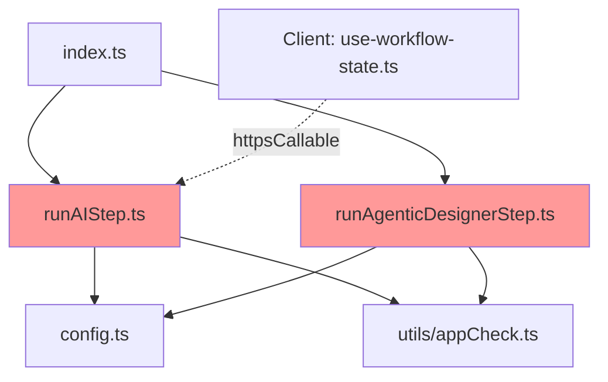

# Refactoring Analysis Report: runAIStep.ts

**Generated**: 2026-04-18
**Target File**: `functions-ai/src/functions/runAIStep.ts`
**Analyst**: Claude Refactoring Specialist
**Report ID**: refactor_runAIStep_18-04-2026_160000

---

## Executive Summary

`runAIStep.ts` is 769 lines (54% over the 500-line project limit) containing 2 cloud functions, 6 utility functions, and 8 local type definitions. **~200 lines** are duplicated nearly verbatim from the sibling `runAgenticDesignerStep.ts` (886 lines). The file mixes infrastructure concerns (Gemini retry, image upload, JSON extraction), domain logic (context building, interaction result loading), and orchestration (the main cloud function handler) in a single module with zero test coverage.

**Estimated savings**: Extracting shared utilities removes ~200 lines from this file and ~200 from the sibling, yielding 4 focused modules each under 300 lines.

---

## Codebase-Wide Context

### Related Files Discovery
- **Target file imported by**: 1 file (`functions-ai/src/index.ts` re-exports)
- **Target file imports**: 2 internal modules (`../config`, `../utils/appCheck`)
- **Client callers**: `src/firebase/presentation/use-workflow-state.ts` (via `httpsCallable`)
- **Tightly coupled with**: `functions-ai/src/functions/runAgenticDesignerStep.ts` (heavy duplication)

### Additional Refactoring Candidates

| Priority | File | Lines | Reason | Relationship to Target |
|----------|------|-------|--------|------------------------|
| HIGH | `runAgenticDesignerStep.ts` | 886 | Same duplication pattern, same utilities duplicated | Sibling with ~200 identical lines |
| MEDIUM | `extractTopics.ts` | 445 | May share Gemini patterns | Same `functions/` directory |
| LOW | `evaluateSubmissions.ts` | 304 | Under limit | Same directory, shared Firestore patterns |

### Recommended Approach
- **Multi-file refactoring** - Extract shared utilities from both `runAIStep.ts` and `runAgenticDesignerStep.ts` simultaneously. The extracted modules will serve all current and future AI functions.

---

## Current State Analysis

### File Metrics Summary

| Metric | Value | Target | Status |
|--------|-------|--------|--------|
| Total Lines | 769 | <500 | :warning: Over by 54% |
| Functions | 8 | <15 | :white_check_mark: |
| Cloud Function Exports | 2 | - | - |
| Local Type Definitions | 8 | 0 (use shared) | :warning: |
| Test Coverage | 0% | >80% | :x: |
| Change Frequency | 2 commits | Low | - |

### Function-Level Complexity

| Function | Lines | Cyclomatic | Cognitive | Params | Nesting | Risk |
|----------|-------|------------|-----------|--------|---------|------|
| `runAIStep` (handler body) | 222 | 18 | 42 | 1 (request) | 3 | **CRITICAL** |
| `loadInteractionResults` | 96 | 12 | 28 | 5 | 4 | **HIGH** |
| `callGeminiWithRetry` | 75 | 10 | 22 | 5 | 4 | **HIGH** |
| `buildContext` | 68 | 6 | 14 | 7 | 3 | MEDIUM |
| `generateImage` | 48 | 4 | 10 | 4 | 3 | MEDIUM |
| `extractStructuredItems` | 40 | 4 | 8 | 3 | 2 | LOW |
| `summarizeSlideNudges` (handler) | 97 | 6 | 12 | 1 | 2 | MEDIUM |
| `sanitizeInput` | 3 | 1 | 1 | 1 | 0 | LOW |

### Code Smell Analysis

| Code Smell | Count | Severity | Examples |
|------------|-------|----------|----------|
| **Duplication** | ~200 lines | **CRITICAL** | `generateImage`, `extractStructuredItems`, `callGeminiWithRetry` all duplicated in `runAgenticDesignerStep.ts` |
| **Long Method** | 1 | HIGH | `runAIStep` handler body: 222 lines (lines 446-668) |
| **Long Parameter List** | 1 | MEDIUM | `buildContext()`: 7 parameters (line 374) |
| **Local Type Redeclaration** | 8 types | MEDIUM | `AIStepConfig`, `SlideOutput`, `PresentationSlide` etc. redeclared locally instead of importing from shared types |
| **God Function** | 1 | HIGH | `runAIStep` handler does auth, validation, data loading, context building, AI calling, image gen, extraction, Firestore write, error handling |
| **Inconsistent Error Handling** | 2 | MEDIUM | `summarizeSlideNudges` error handling is a near-copy of `runAIStep`'s error block |
| **Magic Strings** | 3 | LOW | Model names `'gemini-3.1-pro-preview'`, `'gemini-3-flash-preview'` hardcoded in multiple places |

### Duplication Detail: runAIStep.ts vs runAgenticDesignerStep.ts

| Pattern | runAIStep.ts | runAgenticDesignerStep.ts | Lines Duplicated |
|---------|-------------|--------------------------|------------------|
| `generateImage()` | lines 220-267 | lines 530-580 | ~48 |
| `extractStructuredItems()` | lines 176-215 | lines 680-720 | ~40 |
| `callGeminiWithRetry()` | lines 97-171 | lines 420-500 | ~75 |
| Gemini client init | lines 591-595 | lines 620-624 | ~5 |
| Error handling (catch block) | lines 639-666 | lines 732-764 | ~30 |
| `summarize*Nudges` function | lines 672-768 | lines 768-886 | ~95 |
| **Total duplicated** | | | **~293 lines** |

---

## Test Coverage Analysis

| File/Module | Coverage | Test File | Critical Gaps |
|-------------|----------|-----------|---------------|
| `runAIStep.ts` | **0%** | None exists | All functions untested |

No test files exist anywhere in `functions-ai/src/` (only `node_modules/` test files from dependencies). The project has no test framework configured for `functions-ai/`.

### Tests That Would Be Needed

| Component | Type | Count | Priority |
|-----------|------|-------|----------|
| `callGeminiWithRetry` | Unit | 5 | HIGH - retry logic, error classification |
| `extractStructuredItems` | Unit | 4 | HIGH - JSON parsing edge cases |
| `loadInteractionResults` | Unit | 6 | HIGH - each interaction type + empty cases |
| `buildContext` | Unit | 4 | MEDIUM - context assembly logic |
| `generateImage` | Unit | 3 | MEDIUM - upload, no-image handling |
| `runAIStep` handler | Integration | 5 | HIGH - end-to-end flow with mocked Gemini |
| `summarizeSlideNudges` | Integration | 3 | LOW - simpler function |

---

## Dependency Analysis

### Dependency Graph

```
runAIStep.ts
├── firebase-functions/v2/https (onCall, HttpsError)
├── @google/genai (GoogleGenAI)
├── firebase-admin (firestore, FieldValue)
├── firebase-admin/storage (getStorage)
├── crypto (randomUUID)
├── ../config (ALLOWED_ORIGINS, REGION, AI_SERVICE_ACCOUNT)
└── ../utils/appCheck (verifyAppCheck)
```



### Existing Shared Utilities (Underused)

| Utility | File | Used By | Could Also Serve |
|---------|------|---------|-----------------|
| `createAIHandler` | `utils/createAIHandler.ts` | `generateQuizWithAI`, `generatePollWithAI`, `generatePresentationWithAI` | NOT suitable for runAIStep (different auth/streaming pattern) |
| `verifyAppCheck` | `utils/appCheck.ts` | All functions | Already used |
| `enforceRateLimitFirestore` | `utils/rateLimit.ts` | `createAIHandler` only | Could be added to runAIStep |
| `stripMarkdownCodeBlocks` | `utils/stripMarkdownCodeBlocks.ts` | Some functions | Not needed here |

---

## Refactoring Plan

### Target Architecture

```
functions-ai/src/
├── functions/
│   ├── runAIStep.ts              (~250 lines: handler + prompt composition)
│   ├── runAgenticDesignerStep.ts  (~550 lines: handler + step prompts)
│   └── ...
├── utils/
│   ├── gemini.ts                  (NEW: ~120 lines: callWithRetry, extractStructuredItems, client factory)
│   ├── imageGeneration.ts         (NEW: ~60 lines: generateImage + upload)
│   ├── interactionResults.ts      (NEW: ~100 lines: loadInteractionResults)
│   ├── appCheck.ts
│   ├── rateLimit.ts
│   └── ...
└── types.ts                       (UPDATED: add SlideOutput, AIStepConfig, PresentationSlide)
```

### Phase 1: Extract shared Gemini utilities (LOW risk)

**New file: `functions-ai/src/utils/gemini.ts` (~120 lines)**

Extract from `runAIStep.ts` lines 97-215:
- `callGeminiWithRetry()` (lines 97-171)
- `extractStructuredItems()` (lines 176-215)
- `createGeminiClient()` (new factory, 5 lines, extracts repeated client init from lines 591-595)
- Model name constants (`GEMINI_PRO`, `GEMINI_FLASH`, `IMAGE_MODEL`)

**Impact**: Both `runAIStep.ts` and `runAgenticDesignerStep.ts` import from this module. Removes ~115 lines from each.

```typescript
// BEFORE (in runAIStep.ts, line 591-595)
const client = new GoogleGenAI({
  vertexai: true,
  project: process.env.GCLOUD_PROJECT || process.env.GOOGLE_CLOUD_PROJECT,
  location: 'global',
});

// AFTER
import { createGeminiClient, callGeminiWithRetry, extractStructuredItems } from '../utils/gemini';
const client = createGeminiClient();
```

### Phase 2: Extract image generation (LOW risk)

**New file: `functions-ai/src/utils/imageGeneration.ts` (~60 lines)**

Extract from `runAIStep.ts` lines 220-267:
- `generateImage()` function (identical in both files)

```typescript
// BEFORE (runAIStep.ts line 604)
imageUrl = await generateImage(client, aiOutput, data.gameId, data.slideId);

// AFTER (same call, different import)
import { generateImage } from '../utils/imageGeneration';
imageUrl = await generateImage(client, aiOutput, data.gameId, data.slideId);
```

### Phase 3: Extract interaction results loader (LOW risk)

**New file: `functions-ai/src/utils/interactionResults.ts` (~100 lines)**

Extract from `runAIStep.ts` lines 273-369:
- `loadInteractionResults()` - currently only used in `runAIStep.ts` but logically independent

This is the highest-complexity function (cyclomatic: 12). Consider also breaking it into per-type handlers internally:

```typescript
// BEFORE (line 293-365): 4 inline if/else branches
for (const el of slide.elements) {
  if (el.type === 'poll') { /* 15 lines */ }
  else if (el.type === 'evaluation') { /* 13 lines */ }
  else if (el.type === 'thoughts') { /* 14 lines */ }
  else if (el.type === 'quiz') { /* 12 lines */ }
}

// AFTER: handler registry pattern
const RESULT_LOADERS: Record<string, (db, gameId, el) => Promise<string | null>> = {
  poll: loadPollResult,
  evaluation: loadEvaluationResult,
  thoughts: loadThoughtsResult,
  quiz: loadQuizResult,
};
```

### Phase 4: Consolidate types (MEDIUM risk)

Move local type definitions (lines 16-86) to `functions-ai/src/types.ts`:
- `AIStepConfig`, `SlideOutput`, `PresentationSlide`, `WorkflowConfig`, `PresentationSettings`
- Remove corresponding duplicates from `runAgenticDesignerStep.ts`
- Keep request/response interfaces (`RunAIStepRequest`, `RunAIStepResponse`) local (they're function-specific)

**Risk note**: Must verify that the shared types match what Firestore actually stores. Type mismatches could cause runtime errors.

### Phase 5: Simplify the main handler (MEDIUM risk)

After phases 1-4, `runAIStep.ts` shrinks to ~350 lines. Further decomposition of the main handler:

Extract `composePrompt()` (~20 lines, lines 567-583) — pure function, easy to test:
```typescript
function composePrompt(
  targetContext: string,
  contextString: string,
  nudgeSummary: string,
  currentOutput: string,
  stepPrompt: string,
  sanitizedNudge?: string
): string { ... }
```

Extract `selectModel()` (~5 lines, line 586-588) — pure function:
```typescript
function selectModel(contextLength: number, nudgeLength: number): string { ... }
```

### Phase 6: Deduplicate summarize*Nudges (LOW risk)

`summarizeSlideNudges` (lines 672-768) and `summarizeAgenticNudges` in `runAgenticDesignerStep.ts` (lines 768-886) share ~80% structure. Extract a shared `createNudgeSummarizer(collectionPath)` factory in `utils/gemini.ts`.

---

## Post-Refactoring File Sizes

| File | Before | After | Change |
|------|--------|-------|--------|
| `runAIStep.ts` | 769 | ~280 | -64% |
| `runAgenticDesignerStep.ts` | 886 | ~550 | -38% |
| `utils/gemini.ts` | 0 (new) | ~120 | +120 |
| `utils/imageGeneration.ts` | 0 (new) | ~60 | +60 |
| `utils/interactionResults.ts` | 0 (new) | ~100 | +100 |
| `types.ts` | 283 | ~340 | +57 |

**Net**: All files under 500 lines. Total codebase slightly smaller due to deduplication.

---

## Risk Assessment

### Risk Matrix

| Risk | Likelihood | Impact | Score | Mitigation |
|------|------------|--------|-------|------------|
| Breaking Cloud Function behavior | Low | **High** | 4 | Extract-only refactoring, no logic changes. Deploy to dev first. |
| Import path errors after extraction | Medium | Low | 3 | TypeScript compiler catches immediately |
| Type mismatches when consolidating | Medium | Medium | 4 | Verify types against Firestore data before consolidating |
| `runAgenticDesignerStep` breakage | Low | Medium | 3 | Refactor both files in same PR, test both functions |
| Cold start regression (more modules) | Low | Low | 1 | Firebase Functions V2 handles module splitting well |

### Rollback Strategy
1. All changes in a single feature branch `refactor/ai-step-functions`
2. No API/interface changes — Cloud Function signatures unchanged
3. Git revert to pre-refactoring commit if issues arise
4. Deploy to dev environment first, verify with manual testing

---

## Implementation Checklist

```json
[
  {"id": "1", "content": "Create feature branch refactor/ai-step-functions", "priority": "high"},
  {"id": "2", "content": "Create utils/gemini.ts: extract callGeminiWithRetry, extractStructuredItems, createGeminiClient, model constants from runAIStep.ts lines 97-215", "priority": "high"},
  {"id": "3", "content": "Create utils/imageGeneration.ts: extract generateImage from runAIStep.ts lines 220-267", "priority": "high"},
  {"id": "4", "content": "Create utils/interactionResults.ts: extract loadInteractionResults from runAIStep.ts lines 273-369", "priority": "high"},
  {"id": "5", "content": "Update runAIStep.ts to import from new utility modules, remove extracted code", "priority": "high"},
  {"id": "6", "content": "Update runAgenticDesignerStep.ts to import shared utilities, remove duplicated code", "priority": "high"},
  {"id": "7", "content": "Move shared types (AIStepConfig, SlideOutput, PresentationSlide) to types.ts", "priority": "medium"},
  {"id": "8", "content": "Extract composePrompt and selectModel helpers within runAIStep.ts", "priority": "medium"},
  {"id": "9", "content": "Extract shared summarizeNudges factory to utils/gemini.ts", "priority": "low"},
  {"id": "10", "content": "TypeScript build validation: npx tsc --noEmit in functions-ai/", "priority": "high"},
  {"id": "11", "content": "Deploy to dev environment and test both runAIStep and runAgenticDesignerStep", "priority": "high"},
  {"id": "12", "content": "Verify Firestore data structure matches consolidated types", "priority": "medium"}
]
```

---

## Success Metrics

| Metric | Before | Target | 
|--------|--------|--------|
| `runAIStep.ts` lines | 769 | <300 |
| `runAgenticDesignerStep.ts` lines | 886 | <600 |
| Duplicated lines | ~293 | 0 |
| Max cyclomatic complexity | 18 | <12 |
| Files over 500-line limit | 2 | 0 |
| Shared utility modules | 0 | 3 |

---

## Appendix A: Complexity Heatmap

```
runAIStep.ts — Line-by-line complexity map

Lines   1-86   [====      ] Types & imports (low, but redundant)
Lines  88-93   [=         ] sanitizeInput (trivial)
Lines  97-171  [========  ] callGeminiWithRetry (HIGH: retry loop + error classification)
Lines 176-215  [=====     ] extractStructuredItems (MEDIUM: JSON parsing)
Lines 220-267  [=====     ] generateImage (MEDIUM: Storage upload)
Lines 273-369  [=========*] loadInteractionResults (HIGH: 4-branch db queries, deepest nesting)
Lines 374-442  [======    ] buildContext (MEDIUM: context assembly)
Lines 446-668  [**********] runAIStep handler (CRITICAL: 222-line orchestrator)
Lines 672-768  [======    ] summarizeSlideNudges (MEDIUM: standalone function)

Legend: [*] = CRITICAL  [=] = proportional complexity
```

## Appendix B: Extraction Order Rationale

Phases are ordered by **increasing risk, decreasing duplication payoff**:

1. **Gemini utils** (Phase 1): Pure functions, zero side effects beyond API calls. Highest deduplication payoff (~115 lines x 2 files).
2. **Image generation** (Phase 2): Self-contained, no shared state. ~48 lines x 2 files.
3. **Interaction results** (Phase 3): More complex but isolated. Only used in `runAIStep.ts` currently.
4. **Types** (Phase 4): Risk of type mismatches with Firestore data. Requires careful verification.
5. **Handler decomposition** (Phase 5): Touches the critical path. Do last when everything else is stable.

---

*This report serves as a comprehensive guide for refactoring execution.
Reference this document when implementing: `@reports/refactor/refactor_runAIStep_18-04-2026_160000.md`*
